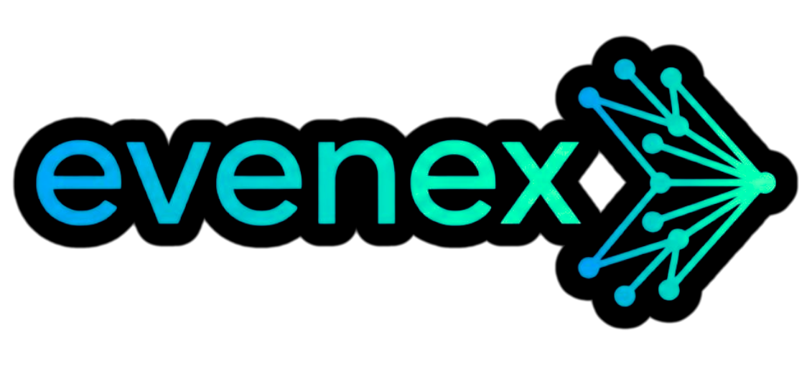

# 🎉 EveNex - AI-Powered Event Management Platform

<div align="center">



**A modern, robust, full-stack event management platform built with Next.js 15, Convex, and AI**

[](https://nextjs.org/)
[](https://convex.dev/)
[](https://www.typescriptlang.org/)
[](LICENSE)

[Live Demo](https://evenex.vercel.app) • [Features](#-key-features) • [Architecture](#-architecture) • [Getting Started](#-getting-started)

</div>

---

## 📋 Table of Contents

- [Overview](#-overview)
- [Key Features](#-key-features)
- [Tech Stack](#-tech-stack)
- [Architecture](#-architecture)
- [Getting Started](#-getting-started)
- [Environment Variables](#-environment-variables)
- [Project Structure](#-project-structure)
- [API Documentation](#-api-documentation)
- [Deployment](#-deployment)
- [Contributing](#-contributing)
- [License](#-license)

---

## 🌟 Overview

**EveNex** is a production-ready event management platform that combines modern web technologies with AI capabilities to streamline event creation, discovery, and management. Built as a showcase of full-stack development skills, it demonstrates enterprise-level architecture, robust security best practices, and seamless third-party integrations.

### 🎯 Problem Statement

Traditional event management platforms lack intelligent automation and often have complex, unintuitive interfaces. EveNex solves this by:
- **AI-Powered Event Creation**: Generate rich event details from natural language descriptions.
- **Smart Email Automation**: Instant ticket confirmations with professional HTML templates, with resilient fallback handling.
- **Seamless Calendar Integration**: One-click calendar exports (.ics format).
- **Real-time Updates**: Live event capacity tracking and registration management.

---

## ✨ Key Features

### 🤖 AI-Powered Event Generation
- Natural language event creation using OpenRouter API.
- Intelligent categorization and capacity suggestions.
- Rate-limited and secured against abuse using Upstash Redis.

### 🎫 Complete Event Management
- **Create & Manage Events**: Full CRUD operations with real-time reactive updates.
- **QR Code Ticketing**: Cryptographically signed JWT QR codes for highly secure event entry.
- **Capacity Tracking**: Live attendee count with automatic full-event detection.
- **Event Analytics**: Detailed organizer dashboard with check-in rates and revenue tracking.

### 📧 Transactional Email System
- Professional HTML email templates using Resend.
- Instant ticket confirmation emails with QR code delivery.
- Graceful, non-blocking error handling to ensure checkout flows never fail.

### 💳 Payment Infrastructure
- Seamless integration with Stripe Checkout for paid events.
- Idempotent webhook processing to prevent duplicate registrations.
- Connect destination charges with a 5% configurable platform fee.

### 🔐 Enterprise-Grade Security
- Clerk authentication with social login support and server-side webhook syncing.
- Route protection powered by Next.js 15 Middleware (`proxy.js`).
- Rate limiting (5 requests/minute) for AI routes.
- Strict database indexing and constraints.

### 🎨 Modern UI/UX
- Responsive design with Tailwind CSS v4.
- Optimistic UI updates for instant feedback.
- Server/Client component splitting for optimal SEO and interactivity.
- Open Graph meta tags for rich social media sharing.

---

## 🛠️ Tech Stack

### Frontend
- **Framework**: Next.js 15 (App Router, Server Components)
- **Language**: JavaScript/TypeScript
- **Styling**: Tailwind CSS v4, Shadcn UI
- **State Management**: React Hooks, Convex React
- **Forms**: React Hook Form + Zod validation

### Backend
- **Database**: Convex (Real-time, Serverless)
- **Authentication**: Clerk (OAuth, JWT, Webhooks)
- **Email**: Resend (Transactional emails)
- **Payments**: Stripe Checkout & Webhooks
- **AI**: OpenRouter (GPT-3.5-turbo)
- **Rate Limiting**: Upstash Redis

---

## 🏗️ Architecture

### System Design

```text
┌─────────────────────────────────────────────────────────────┐
│                         Client Layer                        │
│  (Next.js 15 App Router + React 19 + Tailwind CSS)          │
└────────────────────┬────────────────────────────────────────┘
                     │
                     ▼
┌─────────────────────────────────────────────────────────────┐
│                      API Routes Layer                       │
│  • /api/generate-event (AI Generation + Rate Limiting)      │
│  • /api/calendar/[slug] (ICS Generation)                    │
│  • /api/stripe/checkout (Stripe Sessions)                   │
│  • /api/webhooks/* (Stripe & Clerk Webhook Listeners)       │
└────────────────────┬────────────────────────────────────────┘
                     │
                     ▼
┌─────────────────────────────────────────────────────────────┐
│                    Convex Backend Layer                     │
│  • Mutations (Write Operations)                             │
│  • Queries (Read Operations - Realtime)                     │
│  • Actions (External API Calls)                             │
└────────────────────┬────────────────────────────────────────┘
                     │
        ┌────────────┼────────────┐
        ▼            ▼            ▼
   ┌────────┐  ┌─────────┐  ┌──────────┐
   │ Clerk  │  │ Resend  │  │  Stripe  │
   │  Auth  │  │  Email  │  │ Checkout │
   └────────┘  └─────────┘  └──────────┘
```

---

## 🚀 Getting Started

### Prerequisites

- Node.js 18+ and npm
- Git
- Accounts for: Clerk, Convex, Resend, Stripe, OpenRouter, Upstash

### Installation

1. **Clone the repository**
   ```bash
   git clone https://github.com/tanmay-7706/EveNex.git
   cd EveNex
   ```

2. **Install dependencies**
   ```bash
   npm install
   ```

3. **Set up environment variables**
   ```bash
   cp .env.example .env.local
   # Edit .env.local with your API keys (see Environment Variables section)
   ```

4. **Initialize Convex**
   ```bash
   npx convex dev
   ```

5. **Run the development server**
   ```bash
   npm run dev
   ```

6. **Open your browser**
   Navigate to [http://localhost:3000](http://localhost:3000)

---

## 🔑 Environment Variables

Create a `.env.local` file in the root directory:

```env
# Convex
CONVEX_DEPLOYMENT=your_deployment_name
NEXT_PUBLIC_CONVEX_URL=https://your-project.convex.cloud

# Clerk Authentication
NEXT_PUBLIC_CLERK_PUBLISHABLE_KEY=pk_test_...
CLERK_SECRET_KEY=sk_test_...
NEXT_PUBLIC_CLERK_SIGN_IN_URL=/sign-in
NEXT_PUBLIC_CLERK_SIGN_UP_URL=/sign-up
CLERK_JWT_ISSUER_DOMAIN=https://your-domain.clerk.accounts.dev
CLERK_WEBHOOK_SECRET=whsec_...

# OpenRouter AI
OPENROUTER_API_KEY=sk-or-v1-...
NEXT_PUBLIC_APP_URL=http://localhost:3000

# Resend Email
RESEND_API_KEY=re_...

# Stripe Payments
STRIPE_SECRET_KEY=sk_test_...
NEXT_PUBLIC_STRIPE_PUBLISHABLE_KEY=pk_test_...
STRIPE_WEBHOOK_SECRET=whsec_...

# Upstash Redis (Rate Limiting)
UPSTASH_REDIS_REST_URL=https://...upstash.io
UPSTASH_REDIS_REST_TOKEN=...

# Security Tokens
QR_TOKEN_SECRET=any_random_32_character_string

# Unsplash (Optional - for event images)
NEXT_PUBLIC_UNSPLASH_ACCESS_KEY=...
```

---

## 📁 Project Structure

```text
evenex/
├── app/                          # Next.js App Router
│   ├── (auth)/                   # Authentication pages
│   ├── (main)/                   # Protected routes (dashboard, tickets)
│   ├── (public)/                 # Public routes (explore, event details)
│   ├── api/                      # API & Webhook routes
│   └── proxy.js                  # Next.js 16 Middleware for auth
├── components/                   # React components (UI & Layout)
├── convex/                       # Backend (Convex database schema & logic)
├── lib/                          # Utility functions (QR Tokens, Emails)
├── hooks/                        # Custom React hooks
├── public/                       # Static assets
└── .env.local                    # Environment variables
```

---

## 🚢 Deployment

### Deploy Frontend (Vercel)

1. Push your code to GitHub.
2. Import the repository into [Vercel](https://vercel.com).
3. Add all environment variables from your `.env.local` to the Vercel Project Settings.
4. Deploy!

### Deploy Backend (Convex)

Deploy your Convex functions to production:
```bash
npx convex deploy
```

Set your production secrets in the Convex dashboard or via CLI:
```bash
npx convex env --prod set RESEND_API_KEY your_key
npx convex env --prod set STRIPE_SECRET_KEY your_key
```

---

## 🤝 Contributing

Contributions are welcome! Please follow these steps:

1. Fork the repository
2. Create a feature branch (`git checkout -b feature/AmazingFeature`)
3. Commit your changes (`git commit -m 'Add AmazingFeature'`)
4. Push to the branch (`git push origin feature/AmazingFeature`)
5. Open a Pull Request

---

## 📄 License

This project is licensed under the MIT License - see the [LICENSE](LICENSE) file for details.

---

## 👨‍💻 Author

**Tanmay Singh**
- GitHub: [@tanmay-7706](https://github.com/tanmay-7706)

---

<div align="center">

**⭐ Star this repository if you find it helpful!**

Made with ❤️ by Tanmay Singh

</div>
